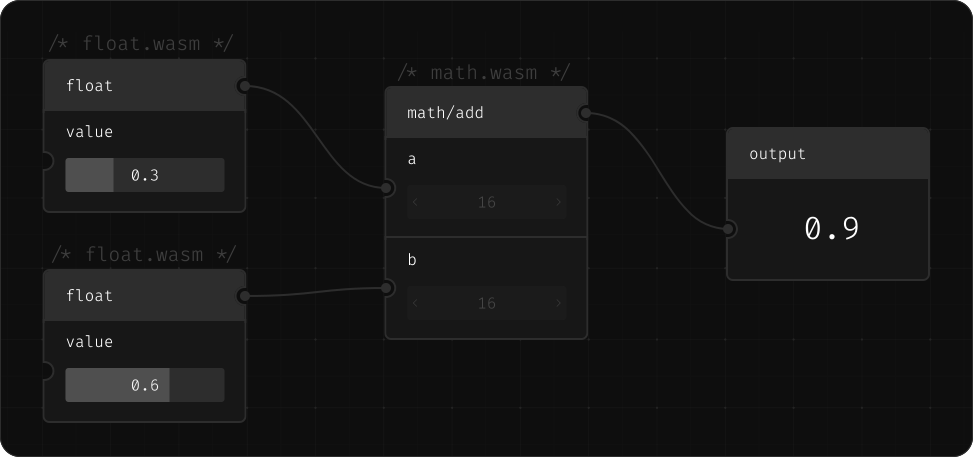

Nodarium

<div align="center">

<a href="https://nodes.max-richter.dev/"><h2 align="center">Nodarium</h2></a>

<p align="center">
    Nodarium is a WebAssembly based visual programming language.
  </p>



</div>

Currently this visual programming language is used to develop <https://nodes.max-richter.dev>, a procedural modelling tool for 3d-plants.

# Table of contents

- [Architecture](./docs/ARCHITECTURE.md)
- [Developing](#developing)
- [Roadmap](#roadmap)

# Developing

### Install prerequisites

- [Node.js](https://nodejs.org/en/download)
- [pnpm](https://pnpm.io/installation)
- [rust](https://www.rust-lang.org/tools/install)

### Install dependencies

```bash
pnpm i
```

### Build the Nodes

```bash
pnpm build:nodes
```

### Start the dev server

```bash
cd app
pnpm dev
```

### [Now you can create your first node 🤓](./docs/DEVELOPING_NODES.md)

# Releasing

## Creating a Release

1. **Create an annotated tag** with your release notes:

```bash
git tag -a v1.0.0 -m "Release notes for this version"
git push origin v1.0.0
```

2. **The CI workflow will:**
   - Run lint, format check, and type check
   - Build the project
   - Update all `package.json` versions to match the tag
   - Generate/update `CHANGELOG.md`
   - Create a release commit on `main`
   - Publish a Gitea release

## Version Requirements

- Tag must match pattern `v*` (e.g., `v1.0.0`, `v2.3.1`)
- Tag message must not be empty (annotated tag required)
- Tag must be pushed from `main` branch

# Roadmap
